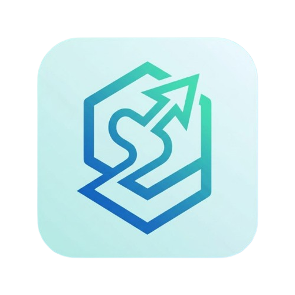
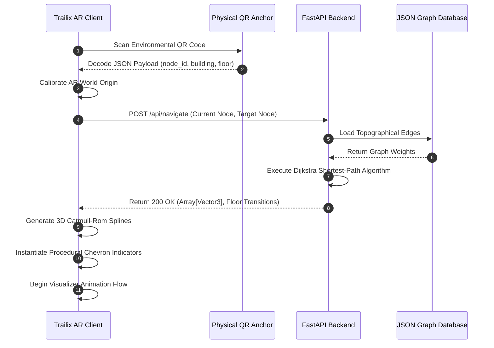

<div align="center">
  
  <h1>Trailix</h1>
  
  

  [](#)
  [](#)
  [](#)
  [](#)
</div>

---

## Executive Summary

**Trailix** is an enterprise-grade Augmented Reality (AR) spatial navigation system engineered specifically for complex, multi-floor indoor and outdoor campus environments. By leveraging Unity's robust AR Foundation framework coupled with a highly responsive, lightweight Python FastAPI backend, Trailix projects precise, contextual routing overlays directly onto the physical world through the user's mobile device camera.

The system abandons traditional 2D map cognitive overload, allowing users to effortlessly follow physical path indicators anchored in real space.

---

## System Architecture

Trailix operates on a strictly decoupled, dual-layer architecture. Interaction between the local client and the server infrastructure is fully asynchronous, guaranteeing low-latency path updates during continuous physical movement.

### Data Flow Diagram



---

## Comprehensive Feature Suite

### 1. Advanced Augmented Reality Visualization
* **Procedural Chevron Arrays**: Instead of relying on static textures or heavy 3D models, Trailix dynamically generates flat, low-profile 3D chevron arrows at runtime. This drastically reduces draw calls and memory overhead.
* **Flow Animation Vectors**: Arrows feature a seamless forward-flow animation algorithm applied to their spatial vectors, providing clear directional cues without overwhelming the user's field of view.
* **Elevation & Multi-Floor Intelligence**: The routing visualizer automatically detects elevation changes. It paints paths intersecting staircases with high-visibility neon yellow markers and elevator shafts with electric violet indicators.

### 2. Precise Spatial Anchoring
* **QR-Based World Localization**: Traditional GPS fails indoors. Trailix utilizes structured QR payloads placed strategically around the campus to instantly calibrate the local AR session coordinate system.
* **Drift Mitigation**: The system continuously monitors the ARCore SLAM (Simultaneous Localization and Mapping) tracking state. If visual features are lost, the user is smoothly prompted to rescan the nearest anchor.

### 3. Dynamic User Experience & Interface
* **Contextual Viewports**: The bottom navigation drawer programmatically expands and collapses based on the user's current routing state. This protects the bottom safe-area (gesture bar) of modern bezel-less devices.
* **Floating State Management**: Non-intrusive, floating status toasts deliver real-time system feedback (e.g., "Scanning QR Payload...", "Navigation Active", "Target Reached").

---

## Repository Structure

The codebase is strictly segregated to enforce single-responsibility principles between the routing mathematics and graphical rendering.

```text
Trailix/
├── ARBackend/                      # Python Server Infrastructure
│   ├── main.py                     # FastAPI Application Entry & Routing
│   ├── requirements.txt            # Python Dependencies (Uvicorn, FastAPI)
│   ├── nodes.json                  # Topographical Graph Data (Vertices/Edges)
│   └── services/                   # Core Pathfinding (Dijkstra/A* Logic)
│
├── ARSpatialClient/                # Unity AR Application Frontend
│   ├── Assets/
│   │   ├── Editor/                 # Custom Unity Editor Tooling (Icon Generators)
│   │   └── ProjectCore/
│   │       ├── Scripts/            # Core C# Logic
│   │       │   ├── AR/             # QR Tracking and SLAM Integrity
│   │       │   ├── Navigation/     # Path Interpolation and Procedural Meshes
│   │       │   ├── Networking/     # Asynchronous API Consumption
│   │       │   └── UI/             # Dynamic Canvas Rendering and Layout
│   │       ├── Textures/           # Sprites and Application Manifest Icons
│   │       └── Scenes/             # Unity Scene Configurations
│   └── Assembly-CSharp.csproj      # Managed Assembly Definitions
│
└── Documentation/                  # System Assets and External Guides
    └── Images/                     # High-Resolution Logos and Schematics
```

---

## Backend API Reference

The backend communicates exclusively via lightweight JSON payloads over REST HTTP.

### Endpoint: `/api/navigate`
**Method**: `POST`  
**Description**: Calculates the shortest physical path between two topological nodes.

**Request Body**:
```json
{
  "start_node_id": "main_entrance_01",
  "end_node_id": "library_floor_3"
}
```

**Response**:
```json
{
  "path": [
    {"x": 10.5, "y": 0.0, "z": -5.2},
    {"x": 12.0, "y": 0.0, "z": -5.2}
  ],
  "transitions": [
    {
      "type": "staircase",
      "start_index": 5,
      "end_index": 6
    }
  ],
  "distance_meters": 45.2
}
```

---

## Build and Deployment Guide

### Phase 1: Backend Initialization

1. **Environment Setup**:
   Navigate to the backend directory and establish a virtual environment.
   ```bash
   cd ARBackend
   python -m venv venv
   source venv/Scripts/activate  # (Windows)
   ```
2. **Install Requirements**:
   ```bash
   pip install -r requirements.txt
   ```
3. **Launch Uvicorn Server**:
   ```bash
   python main.py
   ```
   *The server will initialize on port 8000. Ensure your firewall permits local network traffic so the mobile device can reach this socket.*

### Phase 2: Unity Client Compilation

1. **Open Environment**: Launch `ARSpatialClient` using **Unity 2022.3.62f3**.
2. **Configure API Endpoints**:
   Navigate to `Assets/ProjectCore/Scripts/Networking/CampusApiClient.cs`. Update the `BaseUrl` variable to match the IPv4 address of your local machine hosting the FastAPI instance.
3. **Generate Application Manifest Icons**:
   From the Unity Editor top menu bar, select `Tools > Fix App Icon`. This executes a custom Editor script that maps the 500x500 Trailix PNG to the Android Adaptive, Legacy, and Round manifest properties.
4. **Compile APK**:
   Select `File > Build Settings`. Verify the target platform is set to `Android`. Ensure ARCore is enabled in XR Plugin Management, then click **Build**.
5. **Device Deployment**:
   With your Android device connected via USB (USB Debugging enabled), execute the automated deployment batch script:
   ```bash
   .\install_to_device.bat
   ```

---

## Automated Editor Tooling

Trailix utilizes custom C# Editor scripts to streamline the deployment pipeline. These tools are strictly isolated in `Assembly-CSharp-Editor.csproj` to prevent compilation errors in the final Android payload.

* **Icon Auto-Configuration**: The `FixAppIcon.cs` script intercepts the Unity build pipeline to forcefully override the default Unity splash icons with the Trailix branding, accounting for modern Android Adaptive Icon requirements.

## Team Members

* **Raghu C** — AI & DS, MSRIT, Bangalore, India ([1ms22ad042@msrit.edu](mailto:1ms22ad042@msrit.edu))
* **Rudrapratap Patil** — AI & DS, MSRIT, Bangalore, India ([1ms22ad047@msrit.edu](mailto:1ms22ad047@msrit.edu))
* **Srinidhi N S** — AI & DS, MSRIT, Bangalore, India ([1ms23ad402@msrit.edu](mailto:1ms23ad402@msrit.edu))
* **Mallesh N** — AI & DS, MSRIT, Bangalore, India ([1ms22ad033@msrit.edu](mailto:1ms22ad033@msrit.edu))

---

<div align="center">
  <i>Copyright 2026. Trailix Spatial Navigation System. All Rights Reserved.</i>
</div>
