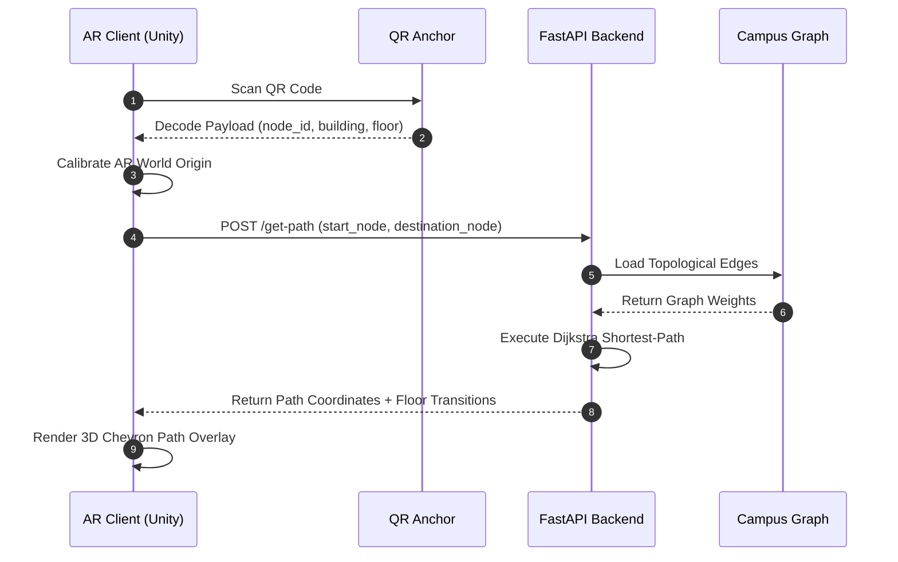

<div align="center">
  
  <h1>Trailix</h1>
  <p><strong>AR-Powered Indoor Campus Navigation System</strong></p>

  <br />

  [](https://fastapi.tiangolo.com/)
  [](#)
  [](#)
  [](#)
  [](#)
</div>

<br />

## Overview

**Trailix** is an augmented reality indoor navigation system designed for multi-floor campus environments. It replaces traditional 2D maps with real-time 3D path overlays rendered directly through a mobile device camera, enabling users to follow physical directional cues anchored in the real world.

The system pairs a **Unity AR client** (targeting Android with ARCore) with a lightweight **Python FastAPI backend** that handles graph-based pathfinding, location management, and an AI-powered natural language chat interface for destination resolution.

---

## Architecture

The system operates on a decoupled client-server architecture. The mobile AR client handles spatial rendering and user interaction, while the backend manages the campus graph, pathfinding algorithms, and AI chat services.



---

## Key Features

### Spatial Navigation
- **QR-Based Localization** -- Physical QR codes placed across campus serve as spatial anchors, calibrating the AR session coordinate system where GPS is unreliable.
- **Procedural Path Rendering** -- Dynamically generated 3D chevron arrows with forward-flow animation provide clear directional guidance without heavy 3D assets.
- **Multi-Floor Routing** -- Automatic detection of elevation changes with distinct visual markers for staircases (yellow) and elevators (violet).

### Intelligent Pathfinding
- **Dijkstra Shortest-Path** -- Server-side graph traversal over a weighted campus topology ensures optimal routing.
- **Floor Transition Handling** -- Seamless path continuity across floors with explicit transition metadata.
- **GPS-Assisted Calibration** -- Automatic building detection and heading estimation to assist initial AR calibration.

### AI Chat Interface
- **Natural Language Destination Resolution** -- Users can describe destinations in plain language (e.g., "Take me to the library") and the system resolves them to graph nodes using semantic matching.
- **LLM-Powered Responses** -- Backed by Hugging Face inference API with configurable model selection.

### Mobile Experience
- **Drift Mitigation** -- Continuous ARCore SLAM tracking state monitoring with automatic rescan prompts when visual features are lost.
- **Contextual UI** -- Adaptive bottom navigation drawer that responds to routing state, respecting modern device safe areas.
- **Real-Time Feedback** -- Floating status indicators for system state (scanning, navigating, arrived).

---

## Repository Structure

```
Trailix/
|
|-- ARBackend/                        # Python Server Infrastructure
|   |-- main.py                       # FastAPI entry point and route definitions
|   |-- schemas.py                    # Pydantic request/response models
|   |-- nodes.json                    # Campus graph data (vertices, edges, weights)
|   |-- requirements.txt             # Python dependencies
|   |-- Dockerfile                    # Container configuration
|   |-- docker-compose.yml            # Multi-service orchestration
|   |-- generate_qr.py               # QR code generation utility
|   |-- start_backend.bat            # Windows launch script
|   |-- start_backend.ps1            # PowerShell launch script
|   +-- services/
|       |-- graph_service.py          # Graph loading, Dijkstra pathfinding
|       +-- chat_service.py          # AI chat and semantic destination matching
|
+-- Documentation/
    |-- BUILD_APK_GUIDE.md            # Android APK build instructions
    |-- BUILD_PRODUCTION_SCENE.md     # Unity scene configuration guide
    |-- HOW_TO_RUN_PROJECT.md         # End-to-end setup walkthrough
    |-- INTEGRATION_TESTING_GUIDE.md  # QR detection and pathfinding validation
    |-- START_BACKEND_GUIDE.md        # Backend deployment reference
    |-- PROJECT_PROGRESS_REPORT.md    # Development progress log
    +-- Images/                       # Logos and schematics
```

---

## Getting Started

### Prerequisites

| Requirement | Version |
|:---|:---|
| Python | 3.10 or higher |
| pip | Latest |
| Network | Mobile device must reach the backend server on port 8000 |

### 1. Clone the Repository

```bash
git clone https://github.com/Srinidhi-070/AR-Campus-Navigation.git
cd AR-Campus-Navigation
```

### 2. Set Up the Backend

```bash
cd ARBackend
python -m venv venv
```

Activate the virtual environment:

| Platform | Command |
|:---|:---|
| Windows (CMD) | `venv\Scripts\activate` |
| Windows (PowerShell) | `venv\Scripts\Activate.ps1` |
| macOS / Linux | `source venv/bin/activate` |

Install dependencies:

```bash
pip install -r requirements.txt
```

### 3. Configure Environment Variables (Optional)

Create a `.env` file in `ARBackend/` for AI chat features:

```env
HF_API_TOKEN=your_huggingface_api_token
HF_MODEL_ID=meta-llama/Llama-3.2-3B-Instruct
```

If not configured, the chat service will gracefully fall back to menu-based destination selection.

### 4. Start the Server

```bash
python main.py
```

The API server will start on `http://0.0.0.0:8000`. Verify by visiting the root endpoint in a browser or with curl:

```bash
curl http://localhost:8000
```

Alternatively, use the provided launch scripts:

```bash
# Windows CMD
start_backend.bat

# PowerShell
.\start_backend.ps1
```

---

## API Reference

### `GET /`

Returns server status and configuration summary.

### `GET /health`

Health check endpoint.

### `GET /locations`

Returns all navigable destination locations in the campus graph.

### `POST /get-path`

Calculates the shortest path between two nodes.

**Request:**
```json
{
  "start_node_id": "main_entrance_01",
  "destination_node_id": "library_floor_3"
}
```

**Response:**
```json
{
  "path": [
    { "x": 10.5, "y": 0.0, "z": -5.2 },
    { "x": 12.0, "y": 0.0, "z": -5.2 }
  ],
  "transitions": [
    {
      "type": "staircase",
      "start_index": 5,
      "end_index": 6
    }
  ],
  "distance_meters": 45.2
}
```

### `POST /chat`

Resolves a natural language query to a campus destination using AI.

**Request:**
```json
{
  "query": "Where is the computer lab?",
  "messages": []
}
```

**Response:**
```json
{
  "answer": "The Computer Lab is located on the 2nd floor of the Main Block.",
  "destination": "computer_lab_01",
  "confidence": 0.92,
  "source": "semantic"
}
```

---

## Docker Deployment

```bash
cd ARBackend
docker-compose up --build
```

The server will be accessible at `http://localhost:8000`.

---

## Documentation

Detailed guides are available in the `Documentation/` directory:

| Guide | Description |
|:---|:---|
| [HOW_TO_RUN_PROJECT.md](Documentation/HOW_TO_RUN_PROJECT.md) | Complete setup walkthrough for both backend and client |
| [BUILD_APK_GUIDE.md](Documentation/BUILD_APK_GUIDE.md) | Step-by-step Android APK build instructions |
| [START_BACKEND_GUIDE.md](Documentation/START_BACKEND_GUIDE.md) | Backend-only deployment reference |
| [INTEGRATION_TESTING_GUIDE.md](Documentation/INTEGRATION_TESTING_GUIDE.md) | End-to-end testing with QR detection and pathfinding |
| [BUILD_PRODUCTION_SCENE.md](Documentation/BUILD_PRODUCTION_SCENE.md) | Unity production scene configuration |

---

## Team

| Name | Program | Institution |
|:---|:---|:---|
| **Raghu C** | AI and Data Science | M.S. Ramaiah Institute of Technology, Bangalore |
| **Rudrapratap Patil** | AI and Data Science | M.S. Ramaiah Institute of Technology, Bangalore |
| **Srinidhi N S** | AI and Data Science | M.S. Ramaiah Institute of Technology, Bangalore |
| **Mallesh N** | AI and Data Science | M.S. Ramaiah Institute of Technology, Bangalore |

---

<div align="center">
  <sub>Copyright 2026 Trailix. All rights reserved.</sub>
</div>
