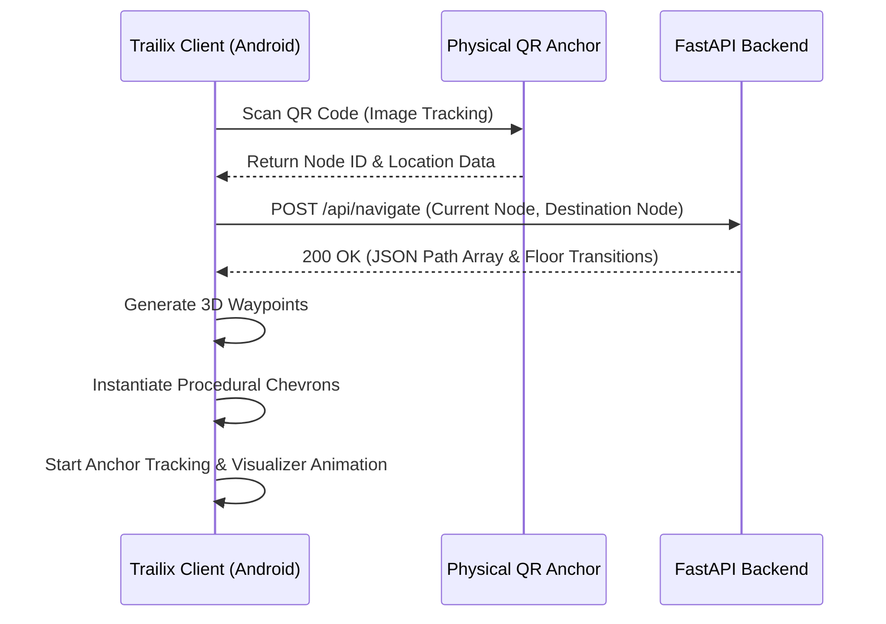

<div align="center">
  
  <h1>Trailix</h1>
  <p><strong>Advanced Spatial Navigation and Augmented Reality Client</strong></p>
  
  [](#)
  [](#)
  [](#)
</div>

---

## Overview

**Trailix** is an enterprise-grade Augmented Reality (AR) spatial navigation system designed for complex indoor and outdoor campus environments. By leveraging Unity AR Foundation and a lightweight Python FastAPI backend, Trailix provides users with precise, contextual routing overlays directly through their mobile device camera.

The system is built upon a dual-layer architecture:
1. **Trailix AR Client (Unity)**: Handles spatial tracking, environmental understanding, camera rendering, and dynamic 3D path visualization using procedural chevron arrays.
2. **Trailix Spatial Backend (Python)**: Manages coordinate graphs, localized points of interest, shortest-path calculation (Dijkstra/A* algorithms), and QR code spatial anchoring.

---

## System Architecture

The interaction between the user device and the server infrastructure is strictly localized and asynchronous to ensure low-latency path updates during physical movement.



---

## Core Features

### Augmented Reality Visualizer
* **Procedural Path Generation**: Renders dynamic, low-profile chevron arrows that curve naturally along the calculated route.
* **Flow Animation**: Arrows animate along the path trajectory to provide clear directional queues without obstructing the physical environment.
* **Elevation Transitions**: Detects and highlights floor transitions (staircases and elevators) using distinct visual materials.

### Spatial Anchoring
* **QR-Based Localization**: Instantly calibrates the AR coordinate system to the physical world using precise QR payload decoding.
* **Persistent Drift Correction**: Continuously monitors the ARCore tracking state to minimize spatial drift over long distances.

### Dynamic User Interface
* **Contextual Drawers**: The bottom navigation drawer expands and collapses smoothly based on the current tracking state, protecting the bottom safe-area (gesture bar) of modern mobile devices.
* **Floating State Toasts**: Provides non-intrusive status updates (e.g., "Scanning...", "Navigation Active").

---

## Project Structure

The repository is organized into distinct sub-projects to decouple the backend infrastructure from the frontend rendering client.

```text
Trailix/
├── ARBackend/                      # Python Server Infrastructure
│   ├── main.py                     # FastAPI Application Entry
│   ├── requirements.txt            # Python Dependencies
│   ├── nodes.json                  # Topographical Graph Data
│   └── services/                   # Pathfinding and Graph Logic
│
├── ARSpatialClient/                # Unity AR Application
│   ├── Assets/
│   │   ├── Editor/                 # Custom Unity Editor Tooling
│   │   └── ProjectCore/
│   │       ├── Scripts/            # Core C# Logic (UI, Navigation, Networking)
│   │       ├── Textures/           # Sprites and Application Icons
│   │       └── Scenes/             # Unity Scene Configurations
│   └── Assembly-CSharp.csproj      # Managed Assembly Definitions
│
└── Documentation/                  # Build and Deployment Guides
    └── Images/                     # Repository Assets
```

---

## Local Development & Deployment

### Backend Initialization

1. Navigate to the backend directory:
   ```bash
   cd ARBackend
   ```
2. Install the required dependencies:
   ```bash
   pip install -r requirements.txt
   ```
3. Start the FastAPI server:
   ```bash
   python main.py
   ```
   *The server will initialize on port 8000. Ensure the IP address is accessible from the mobile device on the local network.*

### Unity Client Compilation

1. Open `ARSpatialClient` using **Unity 2022.3.62f3**.
2. Update the API Endpoint:
   Navigate to `Assets/ProjectCore/Scripts/Networking/CampusApiClient.cs` and ensure the `BaseUrl` points to your active backend IP address.
3. Apply the App Icon:
   Select `Tools > Fix App Icon` from the Unity Editor top menu bar to forcefully generate the Android Adaptive Icons from the high-resolution logo.
4. Build the Project:
   Select `File > Build Settings`, ensure `Android` is the target platform, and click **Build**.
5. Install via ADB:
   Connect your Android device and run the installation script:
   ```bash
   .\install_to_device.bat
   ```

---

## Automated Tooling

* **Icon Generation**: `Tools > Fix App Icon` automatically parses the 500x500 logo and applies it to the Android Adaptive, Legacy, and Round manifest properties.
* **Build Validation**: The `.csproj` environments are strictly separated (`Assembly-CSharp` vs `Assembly-CSharp-Editor`) to prevent Editor scripts from leaking into the production Android build.

---

## License

Copyright 2026. All Rights Reserved. Trailix Spatial Navigation System.
